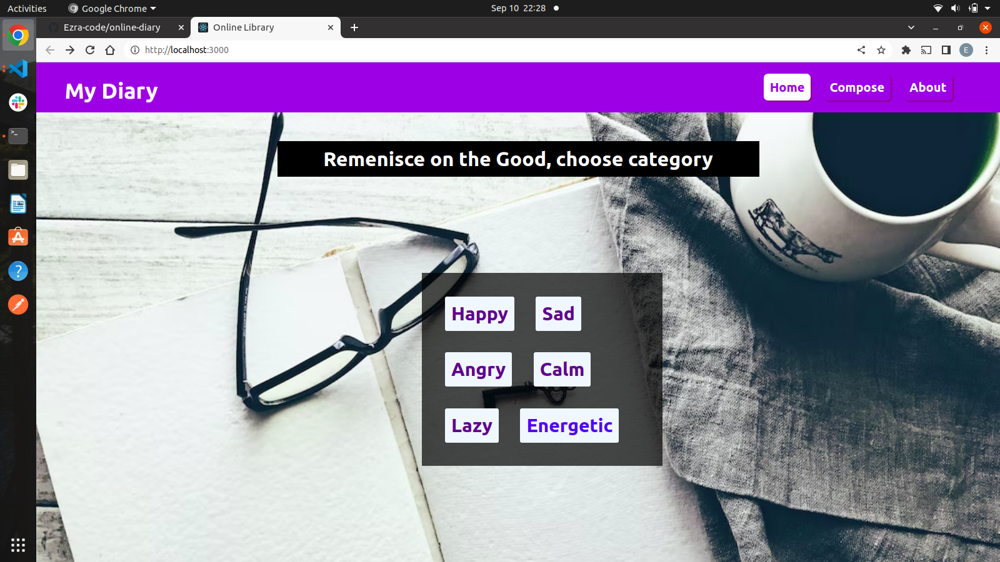

# online diary
 ## By Ezra Njeru
## Screenshot
 
 ## Table of Content
 - [Description](#description)
 - [Features](#features)
 - [Requirements](#requirements)
 - [Installation Process](#installation-Process)
 - [Live Link](#Live-Link)
 - [Technology  Used](#technology-Used)
 - [Licence](#licence)
 - [Authors Info](#Authors-Info)
 ## Description
 
This is a custom diary where a user is able to see all events that happened in their lives. each event is groupe according to the users feelings or mood that day

## Features

As a user of the application,you will be able to :
* Select a feeling/mood and see a list of events associated with such
* see a list of feelings.
* upload a new event to the list
[Go Back to the top](#online-diary)
 ###  Requirements
 * Access to  a computer or any other gadget
 * Access to internet
 ### Installation Process
 ****
* Clone to the repo : https://github.com/Ezra-code/online-diary.git
* Unzip the downloaded files in a folder of choice.
* Open the index file from the zipped file with any browser.
 ****
 [Go Back to the top](#online-diary)
### Live Link

### Technology  Used
* JSX - which was used to develope the structure off the pages.
* CSS - which was used to style the User Interface.
* REACT - was used to make the page responsive and allow web uploads using the apis
* Ruby - to create a link between front end and database
* sqlite - to save our data in order to retrieve it afterwards 
[Go Back to the top](#online-diary)
## Instructions
* The server used to host the backend of the website takes sometime to load so be patient.
## Licence
This project is licensed under the terms of the MIT license
[Go Back to the top](#online-diary)
## Authors Info
Ezra Njeru Kithinji 